
# DONER
Easing tables generator

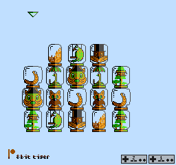

## HOW TO USE

### Help

    `-h` or `--help` to print this text

    Ex.:
        doner --help

### Mode

This program supports two modes: `graph` mode and `table` mode. The `graph` mode allows to see the resulting table values as a graph in the terminal. The UTF-8 Braille characters will be used so the terminal requires UTF-8 support. This does not apply to the `table` mode to work. See section **Running on Windows** for more information.

Graph also shows Y = 0 line as solid line and Y = 1 as dotted line for convinience. The size of the graph depends on the terminal size or defaults to 80x24 when the terminal size is not available. The graph also includes header with min and max values info.

    `-m` or `--mode` to select mode

        Allowed values:

          "graph" for graph mode
          "table" for table mode

        Default value is "graph"

    Ex.:
        doner -m graph
        doner --mode=table

## GENERAL OPTIONS
These options are applicable for all modes

### Easing

Easing functions specify the rate of change of the value over time. In this program the generated function is plotted from 0.0 to 1.0 with the selected level of discretization. The Y values are *usually* 0..1 but some exceptions exist.

    `-e xxx` or `--easy=xxx` to select easing function

        Allowed values:

          "insine",    "inquad",    "incubic",    "inquart",      "inquint", 
          "inexpo",    "incirc",    "inback",     "inelastic",    "inbounce",
          "outsine",   "outquad",   "outcubic",   "outquart",     "outquint", 
          "outexpo",   "outcirc",   "outback",    "outelastic",   "outbounce",
          "inoutsine", "inoutquad", "inoutcubic", "inoutquart",   "inoutquint", 
          "inoutexpo", "inoutcirc", "inoutback",  "inoutelastic", "inoutbounce"

        Default value is "insine"

    Ex.:

        doner -e outquart
        doner --easy=inoutquint

### X/Y Mods

There are two additional submodes for the function - inversion of X or Y values. These are added for the scenario when one needs to reverse the generated values instead of doing it in the processing code.

    `-x xxx` or `--xmod=xxx` to select X modifier in `y = F(x)`
    `-y xxx` or `--ymod=xxx` to select Y modifier in `y = F(x)`

        Allowed values:

          "orig" to keep the original values
          "inv" to invers selected value (multiply by -1)

        Default values are "orig"

    Ex.:

        doner -m graph -e inelastic
        doner -m graph -e inelastic -x orig
        doner -m graph -e inelastic -y orig

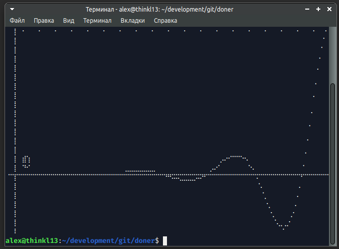

        doner -m graph -e inelastic -x inv
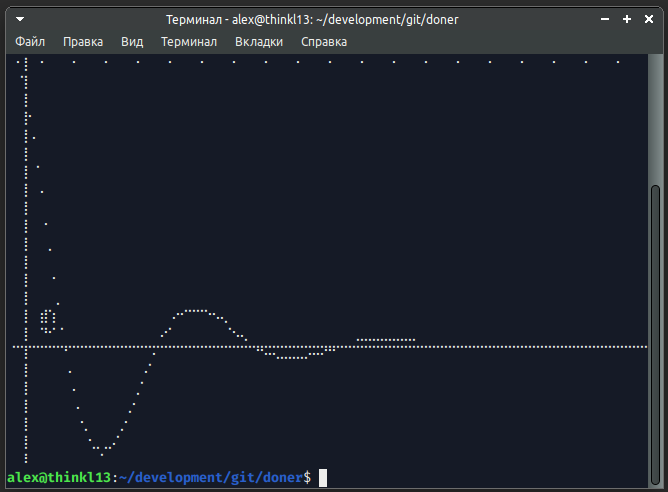

        doner -m graph -e inelastic -y inv
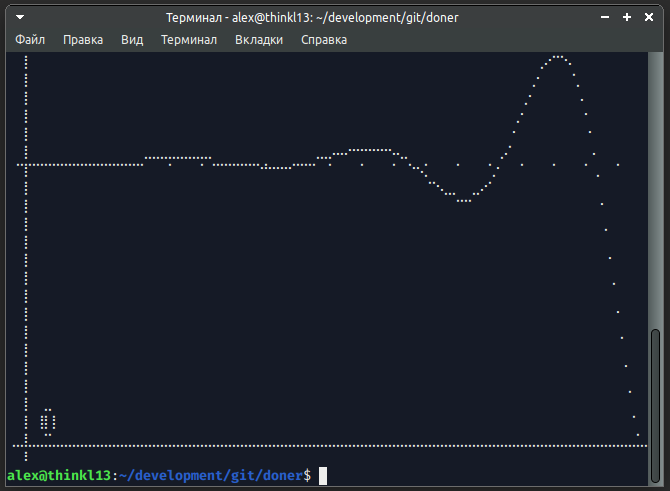

        doner -m graph -e inelastic -y inv -x inv
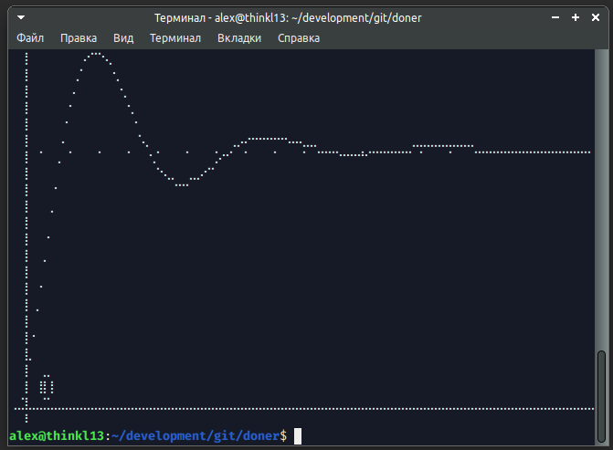

### Overflow

When generating output values it is sometimes vital to fit in an interval, defined by limitations of the platform, limitations of the variable type or the DOM element size. There is a way to set these borders in the output. It is highly recommended to set both of the borders at once as the values will overflow on the other size and without set border the overflowed values will be too small or too high.

    `-t xxx` or `--overflow-top=xxx` for the top overflow border
    `-b xxx` or `--overflow-bottom=xxx` for the bottom overflow border

        Allowed values:

          Anything that could be parsed by libc's `strtod`. Some examples are:
          "123.456", "1.23456e2", "0x453.34p-2"

        Default values are +MAX_DBL and -MAX_DBL respectively

    Ex.:

        doner -m graph -e inback
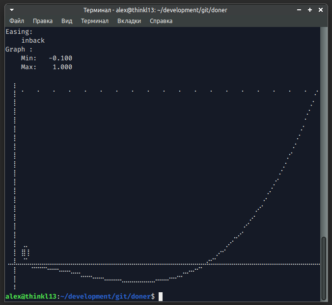

        doner -m graph -e inback -t 0.5 -b -0.5

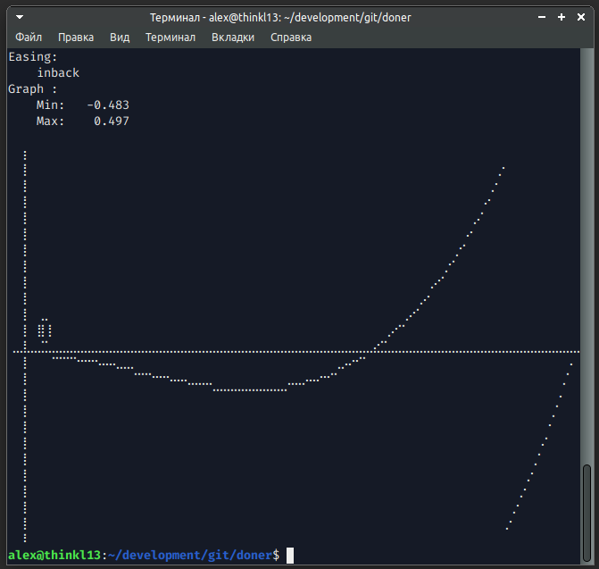

Some useful application of this mode is to fit the graph values into limited variable (using the table mode). For example, in NES the X could have values [0..255]. Imagine the following code:

        lda table, x ; Load the value from our generated table
        clc          ; Clear overflow bit
        adc start_x  ; Add extracted value to the initial animation position
        sta player_x ; Write final value to the player X position

As the screen width is limited by 255 only one byte is provided to store the player position. This leads to the situation when the sum value could be bigger than 255 but will overflow to `N MOD 255`. This can also be used to make animation with negative direction. For example, the `inelastic`:

        doner -m graph -e inelastic
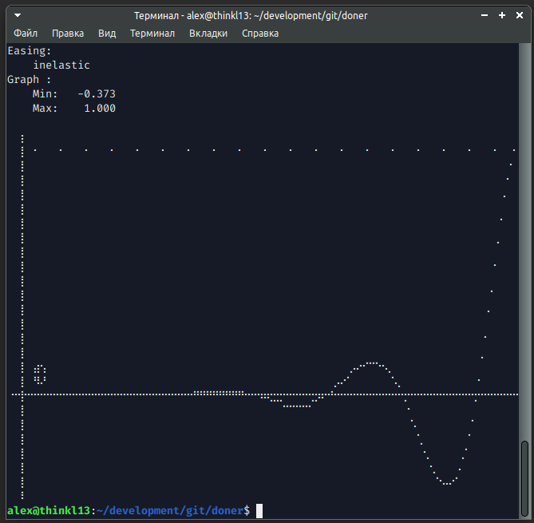

Let's multiplicate the final values by 40 to make it produce values [0..40]:

        doner -m graph -e inelastic -k 40
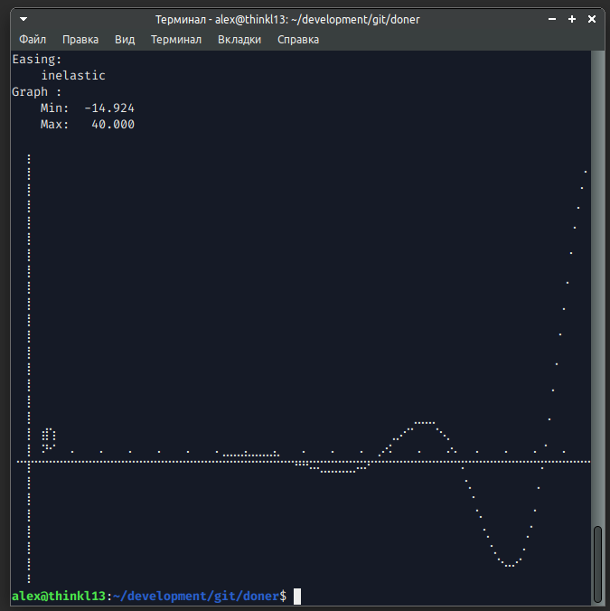

As could be seen there are negative values that will prevent the correct convertation to [0..255] limits. Let's apply the borders:

        doner -m graph -e inelastic -k 40 -b 0 -t 255
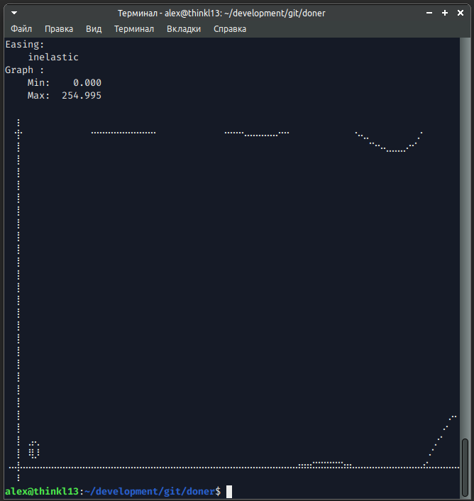

Thus making generated values correctly overflow when summing with some starting position:

        lda table, x ; Load value 250
        clc
        adc start_x  ; Add value 40. 
        ; The resulting value will be (250 + 40) % 255 = 34
        ; On the screen this will look as -6 pixels from the starting point.

### Multiplyer

As mentioned earlier, the resulting value can be multiplied for the case when it cannot be done (or undesirable) in the executing code. For example for the case when the platform cannot operate with floating values. The assigned value will multiply the input value (`y = F(x * k)`):

    `-k xxx` or `--result-multiplier=xxx`to assign multiplier value

        Allowed values:

          Anything that could be parsed by libc's `strtod`.

        Default value is 1.0

### Addend

In some cases shifting the resulting value is required. This can be achieved width another option (`y = F (x) + a`) :

    `-a xxx` or `--result-addend=xxx` to assign shifting value

        Allowed values:

          Anything that could be parsed by libc's `strtod`.

        Default value is 0.0

## TABLE OPTIONS
These options are specific for the `table` mode.

### Cell formatting

As the program could be used to generate output for a variety of platforms the output format isn't fixed and could be reassigned to meet the required standard.

    `-f xxx` or `--first-cell-fmt=xxx` to set first cell's format
    `-c xxx` or `--cell-fmt=xxx` to set middle cells format
    `-l xxx` or `--last-cell-fmt` to set last cell's format

    If the `-f` or `-l` are omitted, the `-c` formatter will be used instead for
    corner cases.

        Allowed values:

          Formatter string for `printf`-function family. Some examples are:
          "%4d, ", "%8.0f", "%hhu". The output value will be automatically
          converted to meet the desired output format. Floating values will
          be rounded (not truncated).

        Default value values are "%8.2f "

    Ex.:

        doner -m table -e inelastic
```
    0.00     0.00    -0.00     0.00     0.00     0.00     0.00  <...>
   -0.01    -0.01    -0.01    -0.01    -0.00    -0.00     0.00  <...>
   -0.02    -0.02    -0.03    -0.04    -0.05    -0.05    -0.04  <...>
    0.05     0.05    -0.01    -0.09    -0.18    -0.26    -0.33  <...>
```
        doner -m table -e insine -c "%3hhu " -k 100
```
  0   0   0   0   0   0   1   1   2   2   3   3   4   4   5   6   7 
  8   8   9  10  11  12  13  15  16  17  19  20  22  23  25  27  28 
 30  30  32  34  36  38  40  42  44  46  48  50  52  54  57  59  61 
 63  63  66  68  71  73  75  78  80  83  85  88  90  93  95  98 100 
```
        (6502 assembly format)
        doner -m table -e insine -f "   .byte $%02x, " -c "$%02x, " -l "$%02x" -k 255
```
   .byte $00, $00, $00, $00, <...> $0b, $0d, $0f, $12
   .byte $14, $14, $17, $19, <...> $3c, $40, $44, $48
   .byte $4d, $4d, $52, $56, <...> $8b, $90, $96, $9c
   .byte $a2, $a2, $a8, $ae, <...> $ec, $f2, $f9, $ff
```
        (C static constant format)
        doner -m table -e insine -f "   [ %f, " -c "%f, " -l "%f ],"
```
   [ 0.000000, 0.000000, 0.000311, <...> 0.052073, 0.060307, 0.069126 ],
   [ 0.078524, 0.078524, 0.088494, <...> 0.250219, 0.266948, 0.284133 ],
   [ 0.301763, 0.301763, 0.319827, <...> 0.566116, 0.588713, 0.611565 ],
   [ 0.634659, 0.634659, 0.657980, <...> 0.950154, 0.975069, 1.000000 ],
```
### Table width

For the convinience the output table width can be adjusted with the following option:

    `-w xxx` or `--table-width=xxx` to set output table width (in elements)

        Allowed values:

          Any possible integer value from 1 to UINT64_MAX

        Default value is 16

    Ex.:

        doner -m table -e insine -w 4
```
    0.00     0.00     0.00     0.00     0.00 
    0.00     0.00     0.01     0.01     0.02 
    0.02     0.02     0.03     0.03     0.04 
<...>
    0.73     0.73     0.75     0.78     0.80 
    0.83     0.83     0.85     0.88     0.90 
    0.93     0.93     0.95     0.98     1.00 
```
### Table size

By default the table is produced for 64 values with the loop where input X values are 0..1 with the increment of 1/64. To change this there is an additional option:

    `-s xxx` or `--table-size=xxx`

        Allowed values:

            Any possible integer value from 1 to UINT64_MAX

        Default value is 64

    Ex.:

        doner -m table -e insine -w 4 -s 16
```
    0.00     0.00     0.01     0.02     0.05 
    0.09     0.09     0.13     0.19     0.26 
    0.33     0.33     0.41     0.50     0.59 
    0.69     0.69     0.79     0.90     1.00 
```
        doner -m table -e insine -w 6 -s 20 -c "%f, "
```
0.000000, 0.000000, 0.003416, 0.013639, 0.030600, 0.054183, 0.084227, 
0.120526, 0.120526, 0.162834, 0.210859, 0.264276, 0.322718, 0.385787, 
0.453052, 0.453052, 0.524053, 0.598305, 0.675301, 0.754515, 0.835405, 
0.917421, 0.917421, 1.000000,
```

###Difference

Sometimes it is faster to operate with previous value of the cell instead of keeping the original value. In this case this flag could be set to write only difference between previous and current cell.

In other words:
```
Original:   [0, 5, 6, 8, 4]
Difference: [0, (5-0), (6-5), (8-6), (4-8)], thus
            [0, 5, 1, 2, -4]
```

Mathematically speaking this values are derivative of the function (rate of change of this function). This flag does not affect the `graph` mode.

Top and bottom limits could be also applied here


    `-d` or `--difference`

    Ex.:

```
       doner -m table -e insine -w 4 -s 8

    0.00     0.03     0.10     0.22
    0.38     0.57     0.78     1.00
```
```
        doner -m table -e insine -d -w 4 -s 8

    0.00     0.03     0.07     0.12
    0.16     0.19     0.21     0.22
```
```
       doner -m table -e insine -f \"   .byte $%02x, \" -c \"$%02x, \" -l \"$%02x\" -w 4 -s 16 -k 40 -t 255 -b 0

    .byte $00, $00, $01, $02
    .byte $03, $05, $08, $0a
    .byte $0d, $10, $14, $18
    .byte $1c, $20, $24, $28
```
```
       doner -d -m table -e insine -f \"   .byte $%02x, \" -c \"$%02x, \" -l \"$%02x\" -w 4 -s 16 -k 40 -t 255 -b 0

    .byte $00, $00, $01, $01
    .byte $02, $02, $02, $03
    .byte $03, $03, $04, $04
    .byte $04, $04, $04, $04
```

**Note:**
Be advised, that in this mode the final point of the object could differ from the last value of the non-diff mode! That happens because of the cumulative rounding error. This cannot be solved easily in the code, as some side effects will present:

* If to remove the `round` call - the 39.999 values will become 39 instead of 40. Thus making final point wrong again
* If to calc diff between printed values (not the original ones) then the ever-growing function will sometime produce decreasing values. Like in the example above:

```
00,  00,  01,  02,  03,  05,  08,  10  F(x)
   0    1    1    1    2    3    2     F(x)'
      1    0    0    1    1   -1       F(x)"
```
So it is recommended to check the final point and correct some values manually (changing the 6th value in this case from 3 to 2 for ex.)

## Running on windows
Unfortunately by default windows `cmd` and `powershell` does not support Braille unicode block. So, the only options are:
1. Install or set the font that do support it (for ex. "MS Gothic", but it has some issues with usual characters).
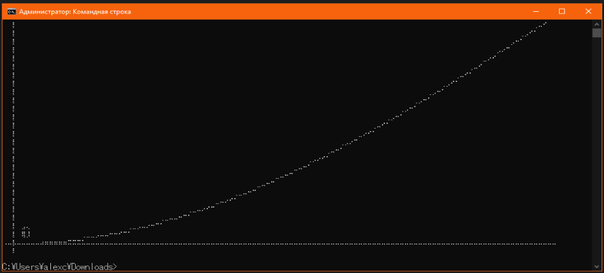
2. Use "Windows terminal" application (from [here](https://apps.microsoft.com/detail/9N0DX20HK701?hl=en-us&gl=US) or [here](https://github.com/microsoft/terminal))
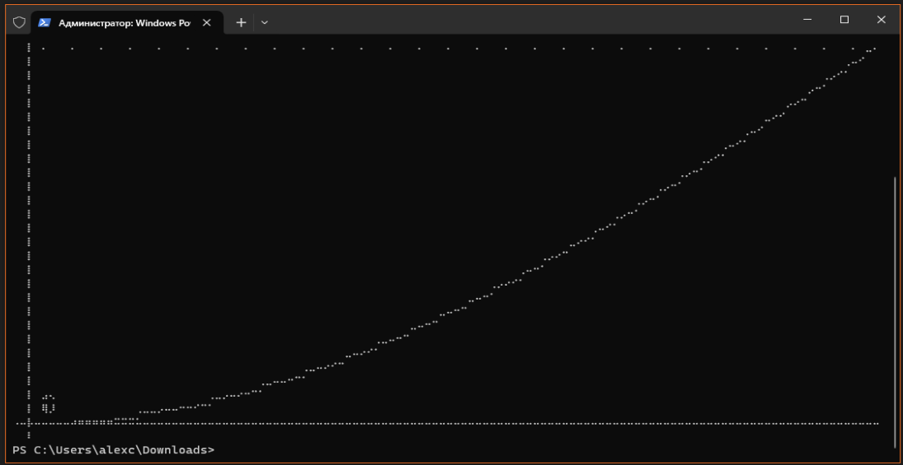
3. Do not use the `graph` mode. The `table` mode works fine in any terminal
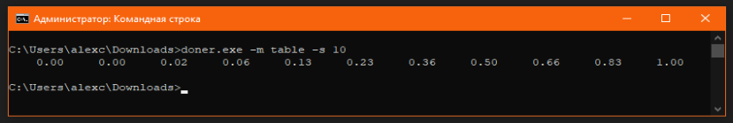

